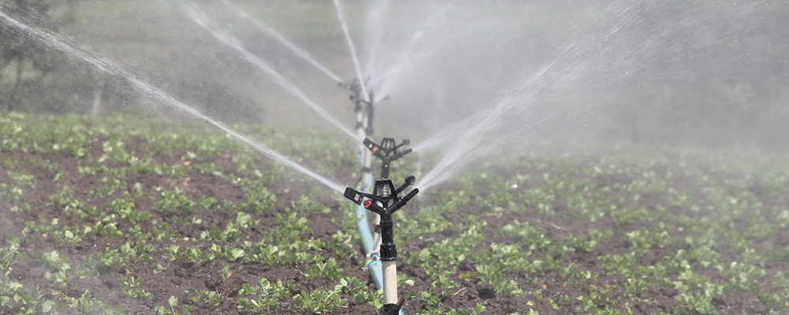

# View Project: 

https://nbviewer.jupyter.org/github/iwasscience/Intelligent-Irrigation-Machine/blob/master/Intelligent_Irrigation_Machine.ipynb

# Predictive Irrigation: Intelligent Irrigation Machine

## Motivation:

Today, climate change is a big problem for a farm. The crops in some regions are threatened, if not destroyed due to heat and drought. If it does not rain enough, watering the fields is often a necessity. The motivation behind this project is to use deep learning to build an intelligent irrigation machine to irrigate the fields of a farm in a more precise and targeted manner by predicting the probability of a parcel having enough water or not. By doing this, we can predictively irrigate the parcels/fields and tackle the heat and drought problem. 

## Tools:

Keras,
Scikit-Learn,
Pandas,
Numpy,
Matplotlib,
Seaborn
  
   
  
  
